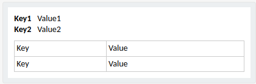

# TeamsMessaging

Simple MS Teams message publisher

Messages created using AdaptiveCards

* [Reference](https://learn.microsoft.com/en-us/microsoftteams/platform/webhooks-and-connectors/how-to/connectors-using?tabs=cURL#send-adaptive-cards-using-an-incoming-webhook)

* [Samples]([Samples and Templates | Adaptive Cards](https://adaptivecards.io/samples/))

* [Designer]([Designer | Adaptive Cards](https://adaptivecards.io/designer))

## 1. Properties

> `spring.application.name` - name of the application
> 
> `spring.profiles.active` - active profile
> 
> `teams.webhook.connector.url` - url of your teams webhook

## 2. Methods

### 2.1 TeamsMessaging

```java
buildDefaultMessage(Map<String, String> dataMap)
```

> 
> 
> Separate table row for each datamap.entry

```java
buildMessage(Map<String, String> factMap, Map<String, String> dataMap)
```

> 
> 
> Separate header row for each factMap.exntry
> 
> Separate table row for each datamap.entry

```java
buildMessageFromJsonString(String adaptiveCardJson, Map<String, String> dataMap)
```

> Replaces the default AdaptiveCard with the one provided and replaces all values with map values.

```java
postTeamsMessage(String message)
```

> Sends provided message to MS Teams webhook
> 
> Can be used with RestTemplate and WebClient. Will automatically find and use bean with proper type.

### 2.2 JsonReader

```java
loadInputString(String input, Class<T> type)
```

> Load input from String.

```java
loadInputFile(String fileName, Class<T> type)
```

> Load input from text file in `resources/` directory.

```mermaid

```