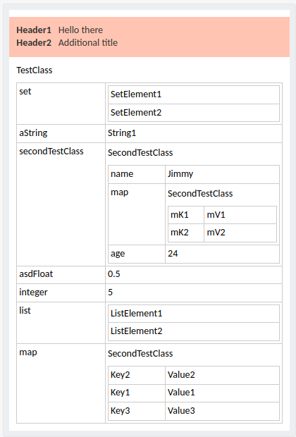

# TeamsMessaging

Simple MS Teams message publisher

Messages created using AdaptiveCards

* [Reference](https://learn.microsoft.com/en-us/microsoftteams/platform/webhooks-and-connectors/how-to/connectors-using?tabs=cURL#send-adaptive-cards-using-an-incoming-webhook)

* [Samples and Templates | Adaptive Cards](https://adaptivecards.io/samples/)

* [Designer | Adaptive Cards](https://adaptivecards.io/designer)

## 1. Properties

> `spring.application.name` - name of the application
> 
> `spring.profiles.active` - active profile
> 
> `teams.webhook.connector.url` - url of your teams webhook

## 2. Methods

### 2.1 TeamsMessaging

```java
buildDefaultMessage(Map<String, String> dataMap)
```

> 
> 
> Separate table row for each dataMap entry

```java
buildMessage(Map<String, String> factMap, Map<String, String> dataMap)
```

> 
> 
> Separate header row for each factMap entry
> 
> Separate table row for each dataMap entry

```java
buildMessageFromJsonString(String adaptiveCardJson, Map<String, String> dataMap)
```

> Replaces the default AdaptiveCard with the one provided and replaces all values with map values.

```java
postTeamsMessage(String message)
```

> Sends provided message to MS Teams webhook
> 
> Can be used with RestTemplate and WebClient. Will automatically find and use bean with proper type.

---

### 2.2 JsonReader

```java
loadInputString(String input, Class<T> type)
```

> Load input from String.

```java
loadInputFile(String fileName, Class<T> type)
```

> Load input from text file in `resources/` directory.

---

### 2.3 AdaptiveTemplate

> #### 2.3.1 Annotations
> 
> * `@AdaptiveCard`
> 
> > * Target: Class
> > 
> > * Parameters:
> >   
> >   * title (String, default "") - will be displayed above the object element in the output
> >   * template (String, default "") - template for custom type
> >   * type (TemplateType, default TemplateType.DEFAULT)
> 
> * `@CardField`
> 
> > * Target: Field
> > * Parameters:
> >   * name (String, default "") - set custom name for the field
> 
> * `@CardIgnore`
> 
> > * Target: Field
> > 
> > * Field will not be displayed in the output
> 
> #### 2.3.2 Methods
> 
> ```java
> static builder()
> ```
> 
> > ```java
> > .object(Object obj)
> > ```
> > 
> > > **(Required)** Class object for processing. Class needs to be annotated with `@AdaptiveCard`.
> > 
> > ```java
> > .facts(Map<String, String> facts)
> > ```
> > 
> > > **(Optional)** Fact map to be displayed over the object.
> > 
> > ```java
> > .style(Style style)
> > ```
> > 
> > > **(Optional)** style for the fact section.
> > 
> > ```java
> > .build()
> > ```
> 
> #### 2.3.3 Usage
> 
> ##### Sample
> 
> > * Input:
> > 
> > ```java
> > @AdaptiveCard(title = "TestClass")
> > public class TestClass {
> >     String aString;
> >     Integer integer;
> >     @CardField(name = "asdFloat")
> >     Float aFloat;
> >     Map<String, String> map;
> >     List<String> list;
> >     Set<String> set;
> >     @CardIgnore
> >     String aString2;
> >     SecondTestClass secondTestClass;
> > 
> >     public static TestClass build() {
> >         return new TestClass(
> >                 "String1",
> >                 5,
> >                 0.5f,
> >                 Map.of("Key1", "Value1", "Key2", "Value2", "Key3", "Value3"),
> >                 List.of("ListElement1", "ListElement2"),
> >                 Set.of("SetElement1", "SetElement2"),
> >                 "String2",
> >                 SecondTestClass.build());
> >     }
> > }
> > ```
> > 
> > ```java
> > @AdaptiveCard(title = "SecondTestClass")
> > @AllArgsConstructor
> > public class SecondTestClass {
> >     String name;
> >     Integer age;
> >     Map<String, String> map;
> > 
> >     public static SecondTestClass build() {
> >         return new SecondTestClass("Jimmy", 24, Map.of("mK1", "mV1", "mK2", "mV2"));
> >     }
> > }
> > ```
> > 
> > ```java
> > TestClass testClass = TestClass.build();
> > Map<String, String> facts = Map.of("Header1", "Hello there", "Header2", "Additional title");
> > 
> > AdaptiveTemplate at = AdaptiveTemplate.builder().facts(facts).object(testClass).style(Style.ATTENTION).build();
> > String apply = at.apply();
> > ```
> > 
> > * Output:
> > 
> > 

---